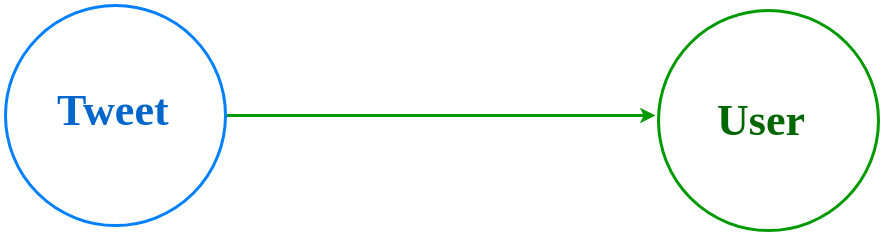

## Designing flock and its mutations
---

In this chapter, you'll learn about Flock's design and schema. We'll decipher the process of designing the application graph. The chapter ends with upserts in Dgraph.

## Table of Contents
---
- [Twitter data](#Twitter-data)
- [Data Modeling](#Data-Modeling)
- [Schema and indices](#Schema-and-indices)
- [Upserts](#Upserts)
- [Building Flock](#Building-Flock)
- [Running Flock](#Running-Flock)
  
## Twitter data 
Flock pulls the tweets from the twitter stream using their developer APIs and stores them in Dgraph. 

[Here is the gist](https://gist.github.com/hackintoshrao/365a6f1610e940999cb0ed162b82cc0d) containing sample JSON data of a tweet obtained from twitter API.

---

## Data Modeling 

Node and Edges are the fundamental units of storing data in the Dgraph. 

Here are the steps to model your application on Dgraph, 
- Identify the different objects or entities in your application data.
- Identify the relationships between them. 
- Draw the application graph with, 
  - Nodes representing the entities/objects.
  - Edges between the nodes to represent their relationship. 
- Associate properties with the nodes.
- Create a Dgraph schema and index.
  
---

Let's go through these steps in detail, 

**Step 1:** Identify the different objects or entities in your application data. 

From the twitter JSON data, we could see two different entities in the data, `Tweets` and `Users.` 

These would be the nodes of the graph. 



---

**Step 2:** Identify the relationships between them. 

Here's a tweet and let's identify it's the relationship with a twitter user. 


As you see, a twitter `User` could be related to a `Tweet` in two ways.
-  An `User` would be `Author` of a `Tweet`. In other words, a `Tweet` would have an `Author`. 
  
-  One or more `Users` could be mentioned in a `Tweet` . 

Thus, the relationship between `Tweets` and `Users` would be `Author` and `Mention`. 

---

**Step 3:** Draw the application graph with Nodes and Edges 


---

**Step 3:** Associate properties with the nodes.

Let's revisit the fields obtained from the tweet and associate them with either of the nodes. 

Let's identify the fields that would belong to a tweet, 


Let's identify the fields that would belong to a User, 


Le's add these to the graph, 


Though conceptually it's easy to visualize the graph with types (Tweets, Users...), 
Dgraph doesn't support it yet. 

However, the good news is that the type system on nodes will be introduced in Dgraph 1.1.
Here is the preview https://docs.dgraph.io/master/query-language/#type-system.

---

Here are questions one could have during the schema design process, 

Q: Is it necessary to normalize the info in a tweet into a `Tweet` and `User` node? 
  
A: Though it still works with doing it, the model would be highly denormalized. The author's info would be duplicated in every tweet. So this hampers, 

- Updates and deletes. 
Let's say. The user wants to change the profile picture. With the denormalized approach, the new `profile_picture_url` update has to be propagated to all the tweets of the user. 

-  Ability to discover insights
Graph databases are distinct because of their ability to traverse the relationships between 
Nodes and discover exciting facts about the data. This is possible only when different 
entities are separated as nodes and are connected by edges representing the relationship
between them.

---

## Schema and indices 

Schema and indices in Dgraph are flexible. These can be altered as your application needs to evolve. 

Also, it's not compulsory to add all the predicates into the schema. Indices are used
to enhance query performance (not mutations). In the next chapter, we'll learn about adding
index to schema based on the query requirements. 

However, one needs to be mindful of upsert requirements during writes. 

---

## Upserts

Dgraph doesn't support primary keys. The uniqueness of the value of a predicate has to ensured manually with the help of upserts.

In Flock, twitter handle has to be unique. Having more than a node for a User with a given 
twitter_handle would be invalid.

Let's first list the predicates which need uniqueness constraint.

The `user_id` of Author nodes and `id_str` of a tweet has to be unique. 

Here are the steps to achieve uniqueness constraint on the predicates mentioned above, 

**Step1:** Add @upsert directive for the predicates and add it to the schema.

```sh

user_id: string  @upsert .
id_str:  string  @upsert .

```

The steps below have to be executed in a single transaction, 

**Step 2:** Run query to check whether a node with the given `user_id` exists.

**Step 3:** Create the new node only if the node doesn't exist. 

Again, the @upsert doesn't ensure the uniqueness of the fields. It only helps ensure the safety of the two-step transaction. 

Refer to these docs to know more about upserts, 

- https://docs.dgraph.io/query-language/#upsert-directive
-   https://docs.dgraph.io/howto/#upserts
-  https://docs.dgraph.io/query-language/#upsert-directive


The new upsert block which would be introduced in 1.1v version release would help you achieve
upsert in one step, [click here](https://docs.dgraph.io/master/mutations/#upsert-block)
of a preview of the new feature. 

---

## Building Flock

We use the following algorithm to build Flock, 

- Fetch data from twitter API
  
For every tweet fetched, 
 - Organize the data based on the fields required for nodes. 
 - Check whether the `Tweet` or the `User` node already exists using upserts.
 -  Create the nodes if they don't exist. 
This applies to `Users` mentioned in the tweet too.
 - Create the `Author` and `Mention` edges from the `Tweet` node to the `User` node. It can be achieved in one mutation calls. 
  
---


## Running Flock
---

The setup instructions are described in [Flock's repo](https://github.com/dgraph-io/flock). Follow the instructions to get Flock up and running.

We are using Docker-compose to run Flock.

---
  
