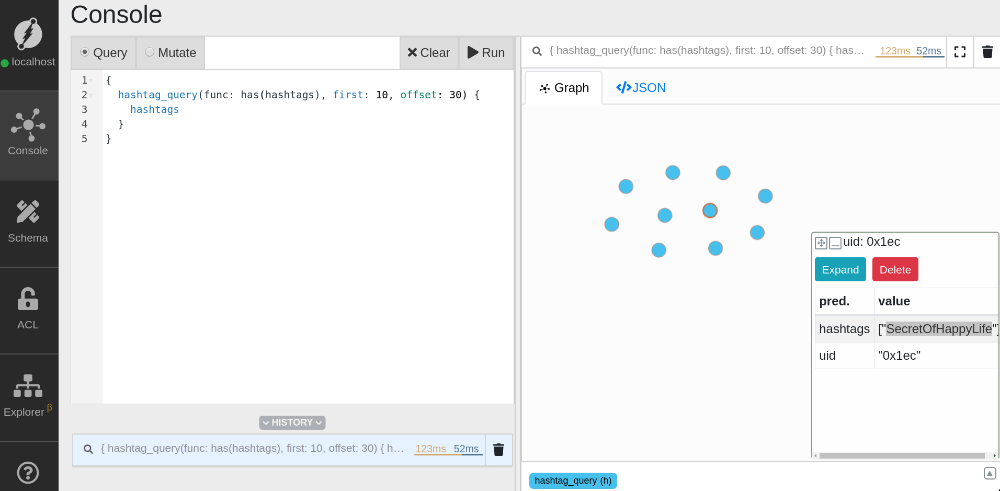
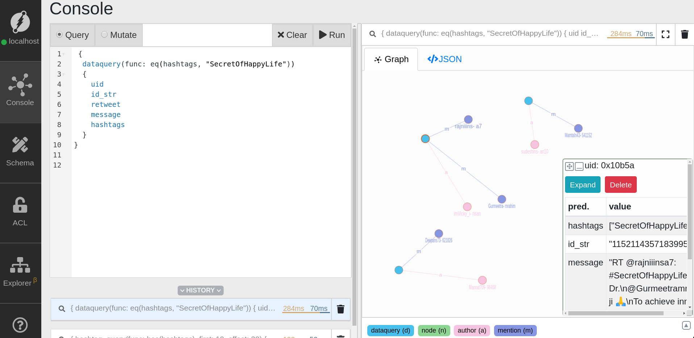
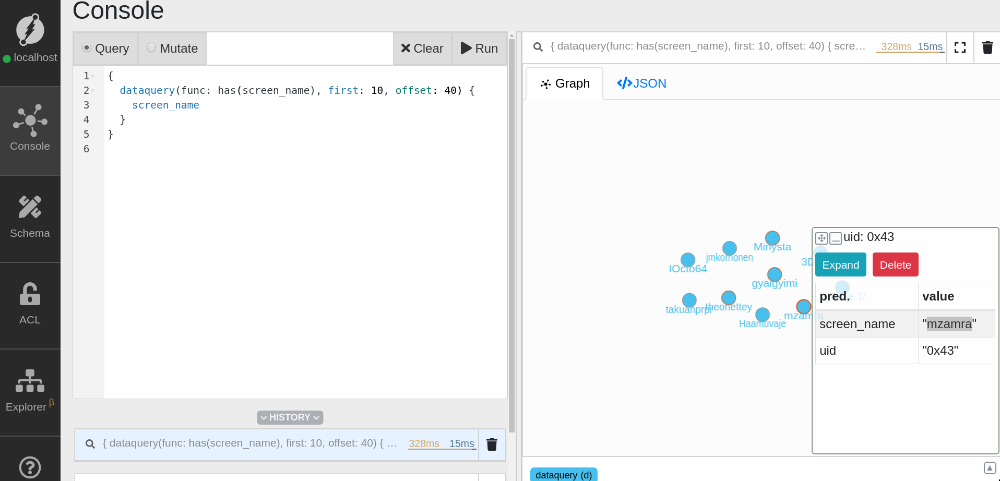
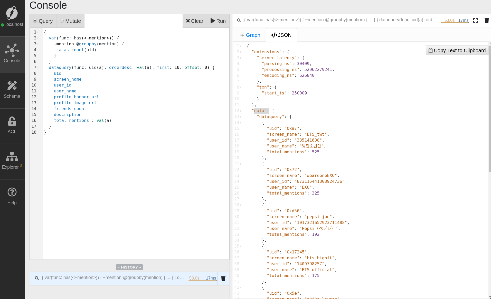
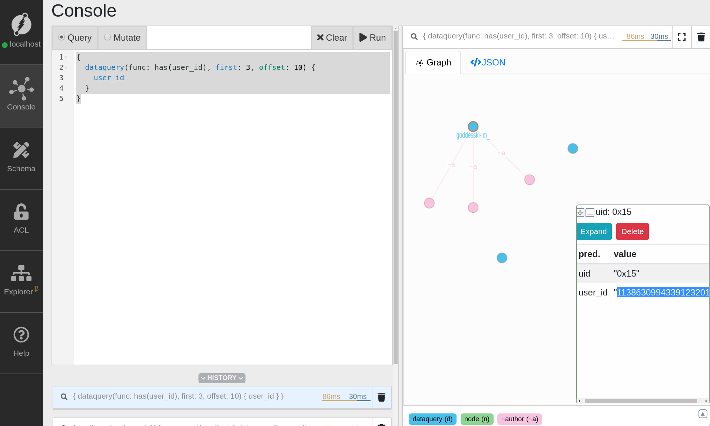
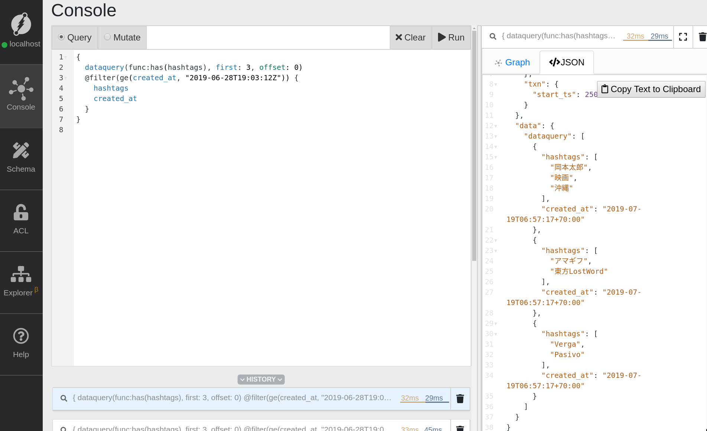
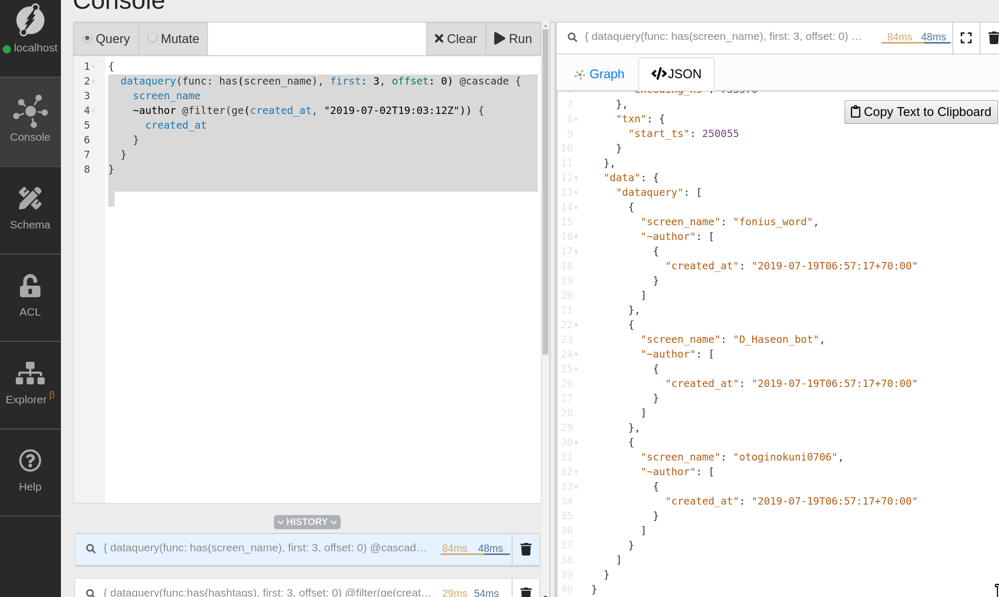

# Flock Querying

In this chapter, we'll be learning about querying in Dgraph. These include searching nodes, 
filtering, traversing, reverse traversing, date-time queries, and much more.

Dgraph's query language is called GraphQL+-. It's inspired by original GraphQL spec, but slightly modified. The modifications were necessary to overcome the shortcomings of GraphQL as a query language for a database. 

---
 # Node selection 
 One of the common operation in Dgraph is to select one or more node based on certain criteria. 

Dgraph's inbuilt functions like `has`, `ge`, `eq` help you express the creteria for selection of nodes in the query. 

In our first query we'll be selecting nodes based on existance of a predicate/property using the `has` function. 

Here is structure of the query, 


```sh
{
    hashtag_query(func: has(hashtags), first: 10, offset: 30) {
        hashtags
    }
}
```


---

```sh
{
    dataquery(func: eq(hashtags, "SecretOfHappyLife")) {
        uid
        id_str
        retweet
        message
        hashtags
    }
}
```




---

```sh
{
  dataquery(func: has(screen_name), first: 10, offset: 40) {
    screen_name
  }
}
```




---


```sh
{
  dataquery(func: eq(screen_name, "mzamra")) {
    uid
    screen_name
    user_id
    user_name
    profile_banner_url
    profile_image_url
    friends_count
    description
  }
}
```


---

```sh
{
  var(func: has(<~mention>)) {
    ~mention @groupby(mention) {
      a as count(uid)
    }
  }
  dataquery(func: uid(a), orderdesc: val(a), first: 10, offset: 0) {
    uid
    screen_name
    user_id
    user_name
    profile_banner_url
    profile_image_url
    friends_count
    description
    total_mentions : val(a)
  }
}
```



---

```
{
  var(func: has(user_id)) {
    a as count(~author)
  }
  dataquery(func: uid(a), orderdesc: val(a), first: 3, offset: 0) {
    uid
    screen_name
    user_id
    user_name
    profile_banner_url
    profile_image_url
    friends_count
    description
    total_tweets : val(a)
  }

}
```


---
```sh
{
  dataquery(func: has(user_id), first: 3, offset: 10) {
    user_id
  }
}
```


---
```sh
{
  dataquery(func: eq(user_id, "1138630994339123201")) {
    uid
    screen_name
    user_id
    user_name
    profile_banner_url
    profile_image_url
    friends_count
    description
  }
}

```


---

```sh
{
  dataquery(func:has(hashtags), first: 3, offset: 0)
  @filter(ge(created_at, "2019-06-28T19:03:12Z")) {
    hashtags
    created_at
  }
}

```

---

```sh
{
  dataquery(func: has(screen_name), first: 3, offset: 0) @cascade {
    screen_name
    ~author @filter(ge(created_at, "2019-07-02T19:03:12Z")) {
      created_at
    }
  }
}
```



---

```sh
{
  dataquery(func: has(screen_name), first: 3, offset: 0) @cascade {
    screen_name
    ~author @filter(ge(created_at, "2019-07-02T19:03:12Z")) {
      created_at
    }
  }
}

```



---

```sh
{
  var(func: has(user_id)) {
    a as count(~author) @filter(ge(created_at, "2019-04-28T19:03:12Z"))
  }
  dataquery(func: uid(a), orderdesc: val(a), first: 3, offset: 0) @cascade {
    uid
    screen_name
    user_id
    user_name
    profile_banner_url
    profile_image_url
    friends_count
    description
    total_tweets : val(a)
    ~author @filter(ge(created_at, "2019-04-28T19:03:12Z")) {
      created_at
    }
  }
}


```