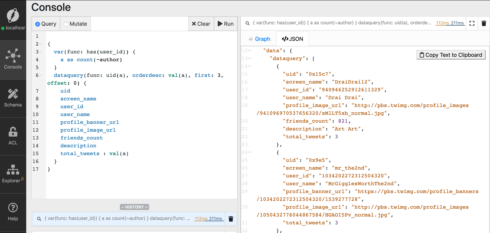

# Querying in Flock
In this chapter, we'll be learning about querying in Dgraph. These include searching nodes, 
filtering, traversing, reverse traversing, date-time queries, and much more.

Dgraph's query language is called GraphQL+-. It's inspired by original GraphQL spec but slightly modified. The modifications were necessary to overcome the shortcomings of GraphQL as a query language for a database. 

Let's recap the graph model of the flock,


---

 ## Query 1: 
 **Search for hashtags**

 One of the standard operation in Dgraph is to select one or more node based on specific criteria. 

Dgraph's inbuilt functions like `has`, `ge`, `eq` help you express the criteria for the selection of nodes in the query. 

In our first query, we'll be selecting nodes based on existence of a predicate/property using the `has` function. 


```sh
{
    hashtag_query(func: has(hashtags), first: 10, offset: 30) {
        hashtags
    }
}
```

Here is structure of the query, 


The query request to "**Select all nodes which has hashtags in it**". In the result we request only for the `hashtags`, hence the other predicates of the node will not be returned. This is similar **select a, b,c** in SQL. 

In the animation below, you could see that only the nodes with non-empty values for `hashtags` predicate/property are selected. 


Let's execute the query in Ratel. From the result, click on any of the nodes and copy a `hashtag`. We'll be using this `hashtag` to run the next query. 
In the image below, you could see that we have chosen the hastag `BOOM`. 


It's essential to notice that the above query is different from "**Give me all the nodes/tweets with specific hashtag #xyz**".

---

## Query 2: 

We can also use filtering to add criterias for node selection. We can filter based any predicate/properties of a node. Indexes have to added to help improve the performance of these queries.

In the following query let us filter the tweets based on their date and time of creation. Let us create a date time index for the `created_at` predicate. 

```sh
created_at: dateTime @index(hour) .
```

The [Getting started guide](../1-getting-started/Readme.md) has details about adding schema using Ratel.

Here's the [reference to docs](https://docs.dgraph.io/query-language/#datetime-indices) to know more about datetime indexes in Dgraph.

```sh
{
  dataquery(func:has(hashtags), first: 3, offset: 0)
@filter(ge(created_at, "2019-06-28T19:03:12Z")) {
    hashtags
    created_at
  }
}

```
Here's the [link to docs](https://docs.dgraph.io/query-language/#applying-filters) to know more about filtering. 


---

## Query 3: 
**Find tweets with a specific hashtag**

Let's query for nodes/tweets with hashtag "BOOM". You should use the hashtag which has been copied from the last query. 

The structure of the query is the same as the last one. However, instead of `has` function, we'll be using the `eq` function. 


```sh
{
    dataquery(func: eq(hashtags, "BOOM")) {
        uid
        id_str
        retweet
        message
        hashtags
    }
}
```

In this case, we are querying for the value of a predicate. This needs index to be set on `hashtags` to speed up the operation. 

Let's add the following schema using Ratel's schema editor. 

```sh
hashtags: [string] @index(exact)
```

Let's execute the query using Ratel, 


---

## Query 4: 
**Find authors of tweets of a given hashtag**

Let's extend the last query to find authors of the tweets with the hashtag "BOOM".

The root-level query finds the tweets based on the hashtag. The first level nested query does the graph traversal along the author's edge. This gives us the final result. 

```sh
{
    dataquery(func: eq(hashtags, "BOOM")) {
        uid
        id_str
        retweet
        message
        hashtags
    }
}
```

Here is the structure of the query. 


Every level of the nested query further traverses the graph. Each level will be using the nodes selected in its previous level as the starting point.


Run the query using Ratel.

---

## Note on direction of the edges

Dgraph doesn't enforce direction to an edge. From our modelling, the `author` edge is supposed to point to a `User` node from a `Tweet` node. But it would work the other way around too. The onus is on the application to enforce this. 

In Flock, we've ensured that that all the `author` edges point from a `tweet` node to a `user` node. 
This makes it easier to select a `tweet` and traverse along the `author` edge to select the `users`. 

But, how about the other way around? Can we start from `author` node and traverse along the `author` edge in the `reverse` direction to reach their `tweets`? 

That's possible! It requires `@reverse` directive to be added to the schema, 
```
author: uid @reverse .`
```

In the next couple of queries, let us start with the author node and do a reverse edge traversal to find their tweets.

---

## Query 5: 
**Find all nodes/users with a screen_name predicate**

This query is similar to Query 1. 

```sh
{
  dataquery(func: has(screen_name), first: 10, offset: 40) {
    screen_name
  }
}

```

Let's execute the query, and we should obtain the screen_names of users. Since we have set the `first` parameter to 10, the result should have a maximum of 10 nodes. 


Copy one of the `user_id` from the result.

---

## Query 6: 
**Find the Tweets of a user.**

Let's use the `screen_name` we just obtained and fetch all the tweets of the User.  

We need to modify the schema to add a `string` index to `screen_name`.

Add the following modification to the schema using Ratel, 

```sh
screen_name: string @index(term) @upsert .
```

If you notice, we have used the term index for `screen_name`. A screen name in twitter could have multiple terms. Like `Francesc Campoy`, `Karthic Rao`, `Daniel Mai`! The `term` index lets one query for any term in the name. You could just search for `Francesc` and obtain the all the users who have the term in their screen names. 


Here is the query, 

```sh
{
  dataquery(func: eq(screen_name, "DraiDrai12")) {
    uid
    screen_name
    user_id
    user_name
    profile_banner_url
    profile_image_url
    friends_count
    description
    ~author {
      uid
      message
    }
  }
}
```

As mentioned earlier, the `author` edge points from a `tweet` to a `user`. Hence, if you start a `user` node, the `author` edge has to be traversed in a reverse direction to obtain their tweets.

Using tilde (~) prefix will traverse an edge in reverse direction. 


Let's run this query on Ratel.


Note: If you run flock for a short duration, the user_id you've selected may not have tweets. They've exist because of the `mentions`. Use the next query find  `user_ids` or `screen_names` with lot of tweets.

---


## Query 7: 
Find users with the highest number of tweets.

```
{
  var(func: has(user_id)) {
    a as count(~author)
  }
  dataquery(func: uid(a), orderdesc: val(a), first: 3, offset: 0) {
    uid
    screen_name
    user_id
    user_name
    profile_banner_url
    profile_image_url
    friends_count
    description
    total_tweets : val(a)
  }

}
```



---

## Query 8: 
Similarly, we could find the users who are most mentioned. This time, let us reverse traverse the `mention` edge and also find the tweets they are mentioned in.

`
```
{
  var(func: has(user_id)) {
    a as count(~mention)
  }
  dataquery(func: uid(a), orderdesc: val(a), first: 3, offset: 0) {
    uid
    screen_name
    user_id
    user_name
    profile_banner_url
    profile_image_url
    friends_count
    description
    total_tweets : val(a)
    ~mention {
      message 
    }
  }

}
```

---

## Query 9

We could add filtering during edge traversal in the nested block. Let's use query 6. In the example below, we add time filter to select only the tweets which are created after `2019-03-02T19:03:12Z"`. 

```sh
{
  dataquery(func: eq(screen_name, "DraiDrai12")) {
    uid
    screen_name
    user_id
    user_name
    profile_banner_url
    profile_image_url
    friends_count
    description
    ~author @filter(ge(created_at, "2019-03-02T19:03:12Z")) {
      uid
      message
      created_at
    }
  }
}
```


---

